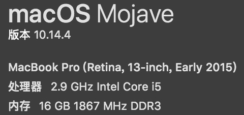
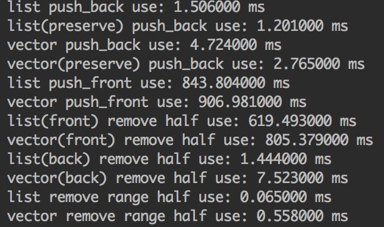
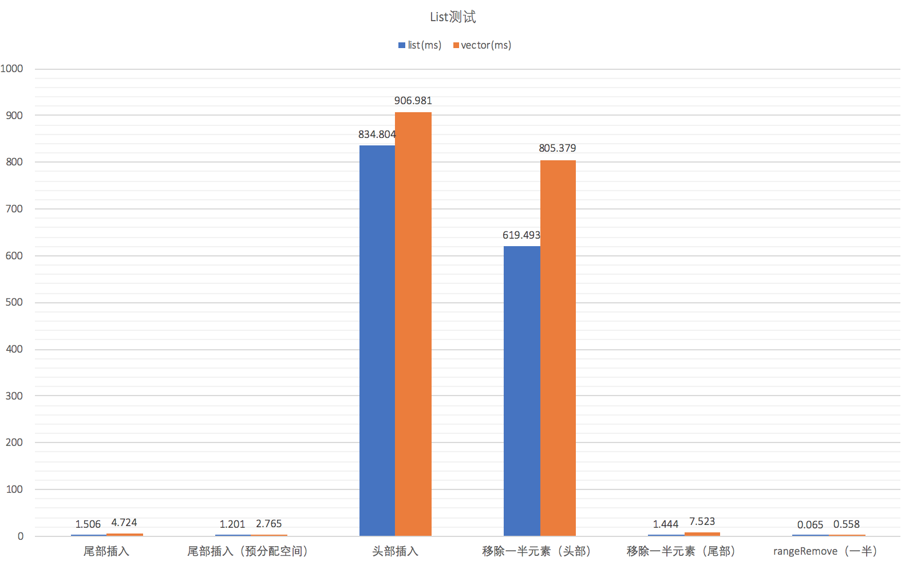
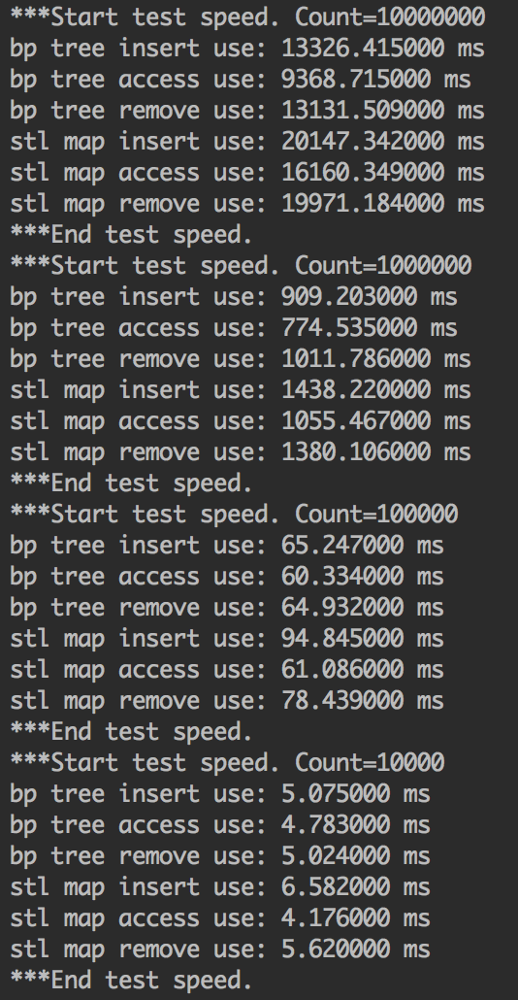
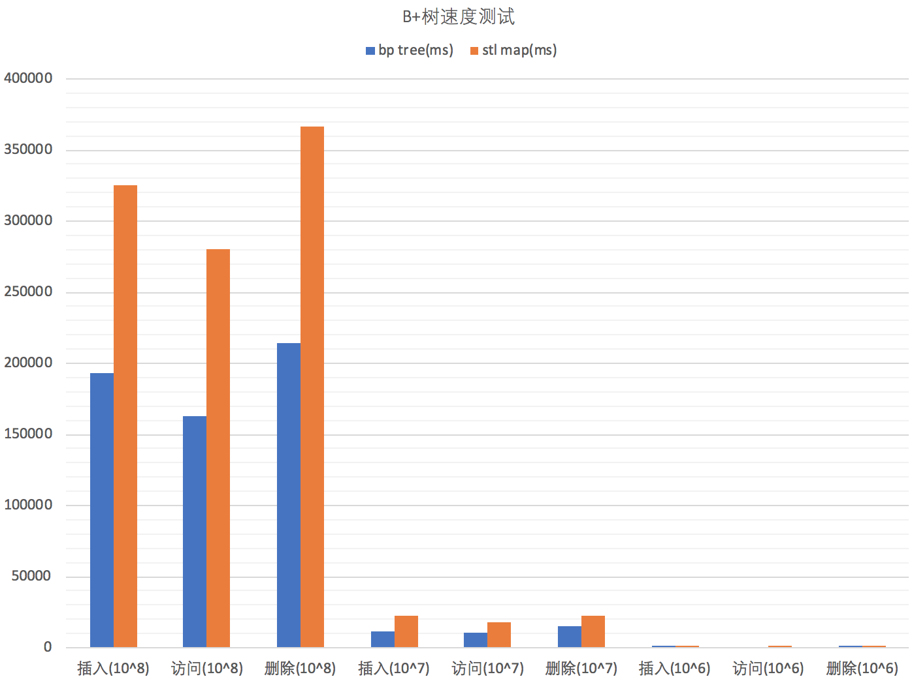
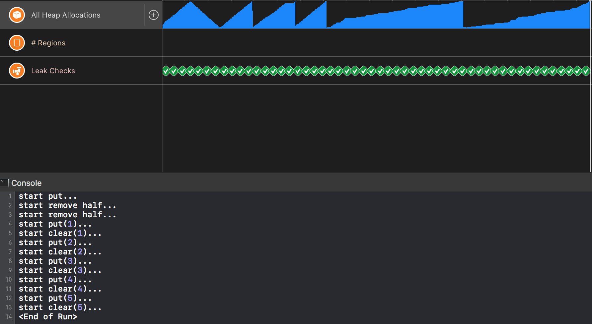
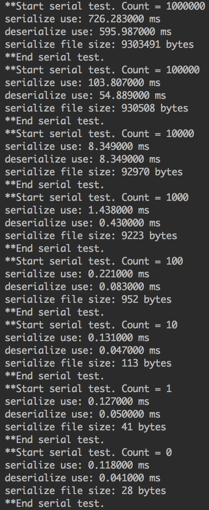

# B+树

## 项目地址

[https://github.com/SirLYC/BPTree](https://github.com/SirLYC/BPTree)

## 目标功能

### B+树简介
引自[维基百科](https://zh.wikipedia.org/wiki/B%2B%E6%A0%91)
> B+ 树是一种树数据结构，通常用于数据库和操作系统的文件系统中。B+ 树的特点是能够保持数据稳定有序，其插入与修改拥有较稳定的对数时间复杂度。B+ 树元素自底向上插入，这与二叉树恰好相反。

### B+树结构

B+树有一个重要的参数叫`阶`(m)，决定了一颗B+树每一个节点存储关键子的个数。

每一个节点都会按顺序存储一组关键字，对于非根节点，其关键字树s >= (m + 1) /2。对于叶子节点，其结构中存储指向值的指针，与关键字对应，同时还有一个next指针，指向下一个兄弟叶子节点，因此找到最左叶子节点后可以按关键字顺序遍历；对于非叶子节点，存有s个指向子节点的指针。

B+树通过插入时分裂，删除时向兄弟节点借关键字或合并兄弟节点实现平衡，所有的叶子节点都在同一层。查询、插入、删除效率都是`Log(N)`。

## public API

``` C++
template<typename K, typename V>
class BPTree {
private:
    ...

public:
    // constructor and destructors
    ...

    /**
     * deserialize from a file
     */
    static std::shared_ptr<BPTree<K, V>> deserialize(const std::string &path);

    static std::shared_ptr<BPTree<K, V>> deserialize(const std::string &path, comparator<K> comp);

    void put(const K &key, const V &value);

    void remove(K &key);

    /**
     * @return NULL if not exists else a pointer to the value
     */
    V *get(const K &key);

    bool containsKey(const K &key);

    int getOrder();

    int getSize();

    /**
     * iterate order by key
     * @param func call func(const K& key, const V& value) for each. func returns true means iteration ends
     */
    template<typename BiApply>
    void foreach(BiApply func);

    template<typename BiApply>
    void foreachReverse(BiApply func);

    /**
     * iterate order by key with index (starts from 0)
     * @param func call func(int index, const K& key, const V& value) for each. func returns true means iteration ends
     */
    template<typename BiApplyIndex>
    void foreachIndex(BiApplyIndex func);

    template<typename BiApplyIndex>
    void foreachIndexReverse(BiApplyIndex func);

    void serialize(std::string &path);

    /**
     * clear the tree
     * note that all values allocated will be freed
     */
    void clear();
};
```

## 重要数据结构

**Node**：B+树的索引节点

主要数据结构如下：

``` c++
struct Node {
    // parent
    // if root, parentPtr == NULL
    Node *parentPtr = NULL;
    // flag
    bool leaf;
    List<K> keys;
    /*-------leaf--------*/
    Node *previous = NULL;
    Node *next = NULL;
    List<V> values;
    /*-------index-------*/
    List<Node *> childNodePtrs;

    // constructor
    ...
};
```

**List&lt;T&gt;**：使用定长数组实现的List，比起std::vector&lt;T&gt;功能更简单，效率更高；内存会在移除一定数量元素后减小。

## 序列化

- 文件后缀为bpt
- 所有数据在文件中为小端序
- 头部格式：

| 偏移(byte) | 大小(byte) |                             内容                             |
| :--------: | :--------: | :----------------------------------------------------------: |
|     0      |     5      |            固定内容，LYCBP，魔数（magic number）             |
|     5      |     1      |         sizeof(short)，用来检测文件与本机器是否兼容          |
|     6      |     1      |                     sizoef(unsigned int)                     |
|     7      |     1      |                         sizoef(long)                         |
|     8      |     4      | sizoefK，每个key占字节数，反序列化时与模板参数不同时抛出异常 |
|     12     |     4      |                  sizeofV，每个value占字节数                  |
|     16     |     4      |                   order，int类型，B+树的阶                   |
|     20     |     4      |        initCap，unsigned int类型，每个节点预分配大小         |
|     24     |     4      |               size，unsigned int类型，元素个数               |

- 如果size不为0，头部结束后就是根节点，节点有同一的格式，节点前面通用格式：

| 偏移(相对于节点起始，byte) |   大小(byte)    |                      内容                       |
| :------------------------: | :-------------: | :---------------------------------------------: |
|             0              |        1        |     leaf，bool类型，标识节点是否为叶子节点      |
|             1              |        4        | kSize，unsigned int类型，该节点拥有的关键字数量 |
|             5              | kSize * sizeofK |                按顺序存储关键字                 |

- 对于叶子节点

| 偏移(相对于节点起始，byte) |  大小(byte)   |     内容     |
| :------------------------: | :-----------: | :----------: |
|    5 +  kSize * sizeofK    | kSize*sizeofK | 按顺序存储值 |

- 对于非叶子节点


| 偏移(相对于节点起始，byte) | 大小(byte) |                   内容                   |
| :------------------------: | :--------: | :--------------------------------------: |
|    5 +  kSize * sizeofK    | kSize * 8  | long类型，按顺序存储字节点在文件中的偏移 |

## 实现要点

- 最初的实现是使用vector，测下来性能不是特别理想；
- 基于节点内关键字有序的特点，查找时使用二分查找；
- 存储子节点应该存储指向节点的指针。因为涉及分裂、合并操作，需要复制列表，如果存储的是结构，复制会造成递归复制，效率低，且不易控制内存；
- 因为`root`节点没有最少关键字限制，在删除节点操作完成后，需要检查一下`root`子节点数量，如果为1，直接将`root`的字节点设置为`root`，否则删除子节点后可能会造成`root`的关键字、子节点丢失。
- 每一次插入、删除节点最后一个关键字后需要向上更新parent。
- 分裂、合并操作时对于叶子节点next和previous指针要更新。

## 测试

**测试环境：**

<center>
    
    <br>
    <div style="color:orange; border-bottom: 1px solid #d9d9d9;
    display: inline-block;
    color: #999;
    padding: 2px;">测试环境</div>
</center>

文件`main.cpp`有如下宏，1表示开启测试：

```
// 测试List性能（和vector对比）
#define TEST_LIST 0
// 测试B+树功能正确性
#define TEST_FUNC 0
// 测试B+树的速度（增删查改）
#define TEST_SPEED 0
// 测试B+树的堆使用及内存泄漏（build后使用工具测试）
#define TEST_MEM 0
// 测试B+树的序列化与反序列化
#define TEST_SERIAL 0
```
### List测试

- 数据量：10^5
- 增、删数据，断言对应位置是否如预期（功能测试）
- 尾部插入测试（预分配和不预分配）
- 头部插入测试
- 头删除测试
- 尾删除测试
- rangeRemove测试

**测试运行结果：**

<center>
    
    <br>
    <div style="color:orange; border-bottom: 1px solid #d9d9d9;
    display: inline-block;
    color: #999;
    padding: 2px;">List测试</div>
</center>

**表格：**

 |                        | List(ms) | vector(ms) |
 | :--------------------: | :------: | :--------: |
 |        尾部插入        |  1.506   |   4.724    |
 | 尾部插入（预分配空间） |  1.201   |   2.765    |
 |        头部插入        | 834.804  |  906.981   |
 |  移除一半元素（头部）  | 619.493  |  805.379   |
 |  移除一半元素（尾部）  |  1.444   |   7.523    |
 |  rangeRemove（一半）   |  0.065   |   0.558    |

 **柱状图：**

 <center>
    
    <br>
    <div style="color:orange; border-bottom: 1px solid #d9d9d9;
    display: inline-block;
    color: #999;
    padding: 2px;">List测试柱状图</div>
</center>

### B+树功能测试

- 数据量：10^5
- 数据插入后断言插入数据存在
- 去除一半数据，断言去除数据不存在，未去除数据存在
- 重新插入所有数据，断言所有数据都存在（测试删除是否破坏结构）
- clear()后断言之前数据都不存在
- 插入全部数据后，测试遍历方法（key顺序测试）

### 速度测试

- 数据量：10^8、10^7、10^6
- B+树阶为 log(TEST_SIZE)^2
- 循环插入数据
- 循环访问所有数据
- 循环移除数据

**测试运行结果：**

<center>
    
    <br>
    <div style="color:orange; border-bottom: 1px solid #d9d9d9;
    display: inline-block;
    color: #999;
    padding: 2px;">B+树速度测试结果</div>
</center>

**表格：**

 |            | bp tree(ms) | stl map(ms) |
 | :--------: | :---------: | :---------: |
 | 插入(10^8) | 192808.064  | 325621.333  |
 | 访问(10^8) | 163102.022  | 280150.403  |
 | 移除(10^8) | 213982.406  | 366576.836  |
 | 插入(10^7) |  11825.821  |  22213.139  |
 | 访问(10^7) |  10190.870  |  18137.073  |
 | 移除(10^7) |  15130.015  |  22133.154  |
 | 插入(10^6) |  1057.291   |  1624.615   |
 | 访问(10^6) |   888.186   |  1155.504   |
 | 移除(10^6) |  1099.584   |  1495.433   |

 **柱状图：**

  <center>
    
    <br>
    <div style="color:orange; border-bottom: 1px solid #d9d9d9;
    display: inline-block;
    color: #999;
    padding: 2px;">B+树速度测试柱状图</div>
</center>

### 内存测试

- 数据量：10^6
- 阶：20
- 添加数据后移除数据
- 循环5次，添加后调用clear()
- 工具：Xcode Instruments

**测试运行结果：**

 <center>
    
    <br>
    <div style="color:orange; border-bottom: 1px solid #d9d9d9;
    display: inline-block;
    color: #999;
    padding: 2px;">B+树内存测试结果</div>
</center>

### 序列化测试
- 数据量：10^6~0

**测试运行结果：**

<center>
    
    <br>
    <div style="color:orange; border-bottom: 1px solid #d9d9d9;
    display: inline-block;
    color: #999;
    padding: 2px;">B+树序列化测试结果</div>
</center>

**表格：**

 | 数据量 | 序列化(ms) | 反序列化(ms) | 文件大小(bytes) |
 | :----: | :--------: | :----------: | :-------------: |
 |   0    |   0.118    |    0.041     |       28        |
 |   1    |   0.127    |     0.05     |       41        |
 |   10   |   0.131    |    0.047     |       113       |
 |  10^2  |   0.221    |    0.083     |       952       |
 |  10^3  |   1.438    |    0.430     |      9223       |
 |  10^4  |   8.349    |    8.349     |      92970      |
 |  10^5  |  103.807   |    54.889    |     930508      |
 |  10^6  |  726.283   |   595.987    |     9303491     |